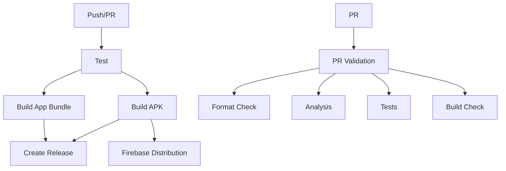

# CI/CD Pipeline Documentation

This repository includes a comprehensive CI/CD pipeline for the Flutter Expense Tracker app using GitHub Actions.

## 🚀 Workflows Overview

### 1. Main CI/CD Pipeline (`ci-cd.yml`)
**Triggers:** Push to main/develop, Pull Requests, Releases

**Jobs:**
- **Test**: Runs Flutter tests, code analysis, and uploads coverage
- **Build APK**: Creates debug/release APKs based on branch
- **Build App Bundle**: Creates AAB files for Play Store
- **Create Release**: Automatically creates GitHub releases with assets
- **Deploy to Firebase**: Distributes APKs to Firebase App Distribution

### 2. Manual Build & Release (`build-release.yml`)
**Triggers:** Manual workflow dispatch

**Features:**
- Choose release type (patch/minor/major)
- Automatic version bumping
- Custom release notes
- Creates tagged releases with APK and AAB files

### 3. PR Validation (`pr-validation.yml`)
**Triggers:** Pull Request events

**Checks:**
- Code formatting
- Static analysis
- Unit tests
- Build validation
- Automated PR comments with status

### 4. Security Scanning (`security.yml`)
**Triggers:** Push to main, PRs, Weekly schedule

**Security Features:**
- Dependency vulnerability scanning
- Secret detection with TruffleHog
- SAST scanning with Semgrep
- Dependency review for PRs

## 🔧 Setup Instructions

### 1. Required Secrets

Add these secrets in your GitHub repository settings:

```
NEWS_API_KEY=your_news_api_key
FIREBASE_API_KEY=your_firebase_api_key
FIREBASE_APP_ID=your_firebase_app_id
FIREBASE_SERVICE_ACCOUNT=your_firebase_service_account_json
```

### 2. Firebase App Distribution Setup

1. Go to Firebase Console → Project Settings → Service Accounts
2. Generate a new private key (JSON format)
3. Add the entire JSON content as `FIREBASE_SERVICE_ACCOUNT` secret
4. Get your App ID from Firebase Console and add as `FIREBASE_APP_ID`

### 3. Branch Protection Rules

Recommended branch protection for `main`:
- Require status checks to pass before merging
- Require branches to be up to date before merging
- Required status checks: `validate`, `test`, `build-apk`

## 📱 Build Outputs

### APK Files
- **Debug builds**: Available for develop branch pushes
- **Release builds**: Available for main branch pushes and releases
- **Naming**: `expense-tracker-{version}.apk`

### App Bundle Files
- **Release only**: Created for main branch and releases
- **Naming**: `expense-tracker-{version}.aab`
- **Use case**: Google Play Store uploads

## 🎯 Usage Examples

### Creating a Release

1. **Automatic (on tag push):**
   ```bash
   git tag v1.2.3
   git push origin v1.2.3
   ```

2. **Manual (workflow dispatch):**
   - Go to Actions → "Build and Release APK"
   - Click "Run workflow"
   - Select release type and add notes
   - Click "Run workflow"

### Testing PRs

1. Create a pull request to `main` or `develop`
2. The PR validation workflow runs automatically
3. Check the PR comment for build status
4. All checks must pass before merging

### Security Scanning

- Runs automatically on pushes and PRs
- Weekly scheduled scans on Mondays
- Check the Security tab for vulnerability reports

## 📊 Monitoring & Artifacts

### Build Artifacts
- APK files are stored for 30 days
- Download from Actions → Workflow Run → Artifacts
- Release assets are permanently stored with releases

### Coverage Reports
- Uploaded to Codecov automatically
- View coverage trends and reports online

### Security Reports
- SARIF files uploaded to GitHub Security tab
- Dependency review comments on PRs
- Secret scanning alerts in Security tab

## 🔄 Workflow Dependencies



## 🛠 Customization

### Adding New Checks
1. Edit `.github/workflows/pr-validation.yml`
2. Add new steps in the validation job
3. Update required status checks in branch protection

### Modifying Build Configuration
1. Edit build commands in workflow files
2. Update Flutter version in `env.FLUTTER_VERSION`
3. Modify build flags as needed

### Environment Variables
- Add new secrets in repository settings
- Reference in workflows using `${{ secrets.SECRET_NAME }}`
- Create `.env` files in build steps as needed

## 📋 Troubleshooting

### Common Issues

1. **Build Failures**
   - Check Flutter version compatibility
   - Verify all secrets are set correctly
   - Ensure dependencies are up to date

2. **Firebase Distribution Failures**
   - Verify Firebase service account JSON is valid
   - Check App ID matches your Firebase project
   - Ensure testers group exists in Firebase

3. **Security Scan False Positives**
   - Review and dismiss false positives in Security tab
   - Add exceptions in workflow files if needed
   - Update scanning rules as required

### Getting Help

- Check workflow logs in Actions tab
- Review error messages in failed jobs
- Consult Flutter and GitHub Actions documentation
- Open issues for pipeline-specific problems